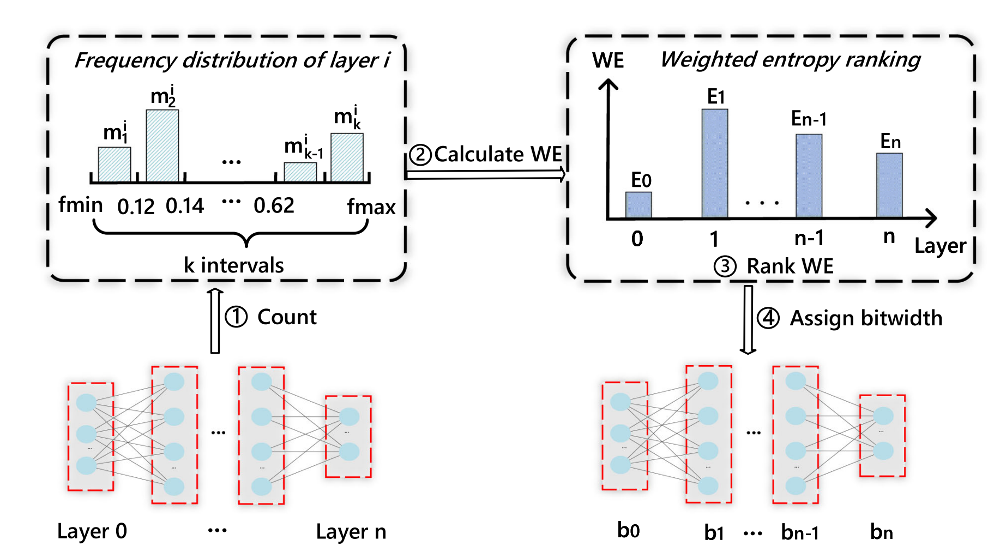
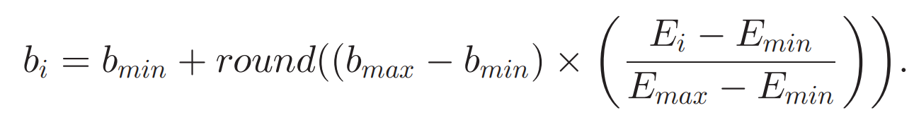
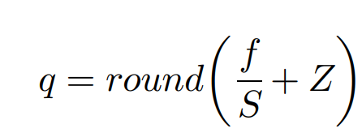
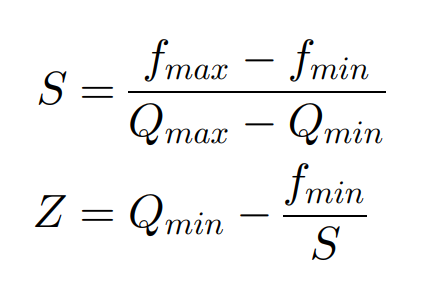

# 基于量化的DNN差分

## 概述

This project is a code replication of the paper titled “Design of a Quantization-Based DNN Delta Compression Framework for Model Snapshots and Federated Learning.” By using the algorithm implemented in this project, you can achieve highly compressed DNN models with minimal loss in model accuracy (as shown in experimental results). Therefore, this project is well-suited for edge computing scenarios with limited storage capacity and can be used for updating model parameters in federated learning and recovering model snapshots in case of damage.

本项目是对论文"Design of a Quantization-Based DNN Delta Compression Framework for Model Snapshots and Federated Learning"的代码复现。通过使用本项目的算法，你可以以极高的压缩率压缩你的DNN模型，只需付出极小的模型精度损失（实验结果）。因此本项目非常适合用于存储有限的边缘计算场景，可用于联邦学习中模型参数的更新，及模型受损时的快照恢复。

## 使用

待完善...

## 具体复现流程

### 量化位宽的选择



- 根据网络获取到每层的权重数量m

$$
将区间[f_{min},f_{max}]划分为k部分（k为超参数），对每部分，统计落在当中的w的数量m
$$

$$
权重参数位于区间=\frac{(x-f_{min})*k}{f_{max}-f_{min}}
$$

- 根据m计算加权熵


- 根据加权熵为每层分配位宽



```python
def calculate_bit_width(model, L=100, k=10):
    """
    This is a function which can calculate each layer's required bit-width of model by weighted entropy.

    Parameters:
     param1 - model
     param2 - this param decide the length of b list
     param3 - decide the division of parameter interval

    Returns:
     bit-width list
    """
    # 计算加权熵
    layer = 0
    E = [0] * L
    state_dict_iter = iter(model.state_dict())
    for name in state_dict_iter:
        weights = model.state_dict()[name]
        weights = weights.reshape(-1)
        area_intersect = torch.histc(weights, bins=k, min=0, max=0)
        # 计算每层的加权熵
        n = weights.numel()
        for m in area_intersect:
            p = m / n
            if p != 0:
                E[layer] += p * math.log2(p)
        E[layer] *= -1
        layer += 1
    # 计算Emax,Emin
    Emin = float("inf")
    Emax = float("-inf")
    for i in range(layer):
        if Emin > E[i]:
            Emin = E[i]
        if Emax < E[i]:
            Emax = E[i]
    # 根据加权熵为每层分配位宽
    b = [0] * L
    bmin = 4
    bmax = 8
    for i in range(layer):
        b[i] = bmin + round(float((bmax - bmin) * ((E[i] - Emin) / (Emax - Emin))))
    return b
```

$$
根据论文6.2.1推荐，b_{min}设置为4bits，b_{max}设置为8bits
$$


### 网络数值量化

将float转换为int





```python
#计算量化所需的S和Z
def calculate_s_and_z(model, b, L=100):
    # 计算量化所需的S和Z
    S = [0] * L
    Z = [0] * L
    state_dict_iter = iter(model.state_dict())
    layer = 0
    for name in state_dict_iter:
        weights = model.state_dict()[name]
        scale = (torch.max(weights) - torch.min(weights)) / (2 ** b[layer] - 1)
        if scale == 0:
            scale = 1e-8
        zero_point = 0 - torch.min(weights) / scale
        S[layer] = scale
        Z[layer] = zero_point
        layer += 1
    return S, Z
```

```python
#生成量化后模型
def quantize_model_and_save_state_dict(model, save_path):
    quantized_model = copy.deepcopy(model)
    b = calculate_bit_width(model)
    S, Z = calculate_s_and_z(model, b)
    for i, (orig_param, quant_param) in enumerate(zip(model.parameters(), quantized_model.parameters())):
        quant_param.data = quantize(orig_param.data, S[i], Z[i])
    torch.save(quantized_model.state_dict(), save_path)
    return S, Z

def quantize_model(model):
    """
    This is a function which can quantize model's parameters.

    Parameters:
     param1 - model

    Returns:
     scale, zero point and state dict of quantized model
    """
    quantized_model = deep_copy_model(model)
    b = calculate_bit_width(model)
    S, Z = calculate_s_and_z(model, b)
    for i, (orig_param, quant_param) in enumerate(zip(model.parameters(), quantized_model.parameters())):
        quant_param.data = quantize(orig_para
```

$$
反量化：f=S(q - Z)
$$

```python
#模型的解量化
def dequantize_model(load_model, dequantized_model, S, Z, device='cuda:0'):
    """
    This is a function which can dequantize quantized model.

    Parameters:
     param1 - model
     param2 - origin dequantized model,it must have same architecture with load model
     param3 - scale
     param4 - zero point
     param5 - work device:cpu or cuda:0

    Returns:
     none
    """
    for i, (orig_param, dequant_param) in enumerate(zip(load_model.parameters(), dequantized_model.parameters())):
        dequant_param.data = dequantize(orig_param.data, S[i], Z[i], device)

```

### 网络更新及误差反馈机制

使用量化后的模型M*进行训练，得到梯度g

用该梯度更新M（而不是M*）

这样做，可以将M*中的量化误差引入到M中的正常训练过程中，使得误差能在每轮训练中动态修正，从而保持了恢复后模型的准确性

<!--用M*的梯度更新M难以实现，妥协选择了后训练量化-->

### Delta计算


```python
def delta_calculator(modelx, modely):
    delta = copy.deepcopy(modelx)
    for i, (delta_param, paramx, paramy) in enumerate(
            zip(delta.parameters(), modelx.parameters(), modely.parameters())):
        delta_param.data = (paramx.data - paramy.data) % 2 ** 8
    return delta
```


> 感觉就是对两个相邻模型做差分就好了

$$
差分恢复：M_1=(D+M_2)mod2^B
$$

```python
ef delta_restore(modelx, delta):
    modely = copy.deepcopy(modelx)
    for i, (delta_param, paramx, paramy) in enumerate(
            zip(delta.parameters(), modelx.parameters(), modely.parameters())):
        paramy.data = (paramx.data + delta_param.data) % 2 ** 8
    return modely
```

### 压缩

使用LZMA压缩增量文件（压缩的太慢了，先使用了gzip）

```python
def Compressor(state_dict, S, Z, compressed_file_name, compressed_s_path, compressed_z_path):
    """
    This is a function which can compress state dict of model.

    Parameters:
     param1 - model's state dict
     param2 - Scale
     param3 - zero point
     param4 - saved path of compressed model's state dict
     param5 - saved path of scale
     param6 - saved path of zero point

    Returns:
     none
    """
    # 提取模型参数
    model_parameters = state_dict
    # 将模型参数转换为字节数据
    parameters_bytes = pickle.dumps(model_parameters)
    # 压缩模型参数
    compressed_parameters = gzip.compress(parameters_bytes)
    compressed_s = gzip.compress(pickle.dumps(S))
    compressed_z = gzip.compress(pickle.dumps(Z))
    # 保存压缩后的模型参数到文件
    with open(compressed_file_name, 'wb') as f:
        f.write(compressed_parameters)
    with open(compressed_s_path, 'wb') as f:
        f.write(compressed_s)
    with open(compressed_z_path, 'wb') as f:
        f.write(compressed_z)
```

### 解压

```python
def Decompressor(decompressed_file_name, decompressed_s_path, decompressed_z_path):
    """
    This is a function which can decompress QDelta file.

    Parameters:
     param1 - save path of model's state dict
     param2 - save path of Scale
     param3 - save path of zero point

    Returns:
     Scale, zero point and model's state dict
    """
    with open(decompressed_file_name, 'rb') as f:
        compressed_parameters = f.read()
    with open(decompressed_s_path, 'rb') as f:
        compressed_s = f.read()
    with open(decompressed_z_path, 'rb') as f:
        compressed_z = f.read()
    # 解压缩模型参数
    decompressed_parameters = gzip.decompress(compressed_parameters)
    decompressed_s = gzip.decompress(compressed_s)
    decompressed_z = gzip.decompress(compressed_z)
    # 将解压缩后的字节数据转换回模型参数
    model_parameters = pickle.loads(decompressed_parameters)
    S = pickle.loads(decompressed_s)
    Z = pickle.loads(decompressed_z)
    state_dict = model_parameters
    return S, Z, state_dict
```

## 联邦学习

- 用户对自己的设备和数据拥有绝对控制权
- 工作节点往往是不稳定设备，设备配置往往也各不相同
- 通信代价远大于计算代价（远程连接）
- 不同设备上的数据不能假设是独立同分布的
- 不同设备负载不平衡（也不允许进行负载均衡）